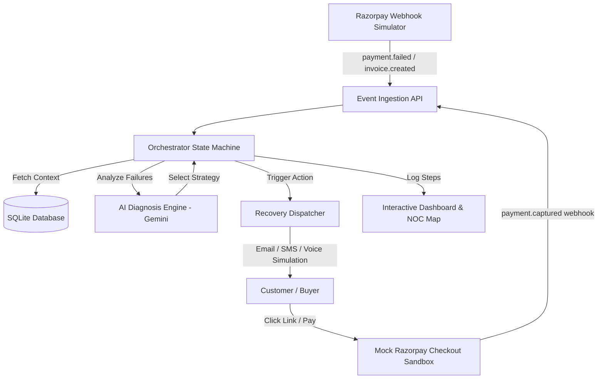

# RazorRecovery AI — Agentic Revenue Recovery & Dunning Engine

[](https://kgupta171025.github.io/Razor-Recovery/)
[](https://github.com/KGupta171025/Razor-Recovery)
[](https://github.com/KGupta171025/Razor-Recovery)
[](https://github.com/KGupta171025/Razor-Recovery)
[](https://github.com/KGupta171025/Razor-Recovery)

> **RazorRecovery AI** is an autonomous, compliant agentic system built for **Track 3 (AI Revenue Recovery)** of the **Razorpay AI Buildathon**. It detects leaking revenue from abandoned checkouts, failed subscriptions, and unpaid B2B invoices, diagnoses transaction failure reasons, and executes bounded, empathetic, and compliant multi-channel recovery campaigns.

---

## 🌐 Quick Access & Live Links

| Resource | Link | Description |
| :--- | :--- | :--- |
| **🚀 Live Interactive Dashboard** | [**kgupta171025.github.io/Razor-Recovery/**](https://kgupta171025.github.io/Razor-Recovery/) | **Full interactive client-side sandbox** — zero installation required. Test NOC routing, AI search, batch simulations, and audit trails directly in your browser. |
| **📦 GitHub Repository** | [**github.com/KGupta171025/Razor-Recovery**](https://github.com/KGupta171025/Razor-Recovery) | Source code, test suite, FastAPI backend, SQLAlchemy models, and state machine orchestrator. |
| **🎛️ Admin Control Room** | [**kgupta171025.github.io/Razor-Recovery/#manage**](https://kgupta171025.github.io/Razor-Recovery/#manage) | System control console for gateway fault injection, PII decryption, and ledger checks *(or double-click the top-left logo)*. |

---

## 🏆 How This Project Hits the Razorpay Hiring Bar

Razorpay's evaluation rubric prioritizes: **Problem Taste, Build Quality, AI Judgment, and Failure Recovery**.

| Hiring Rubric | How RazorRecovery AI Excels |
| :--- | :--- |
| **Problem Taste** | Revenue leakage directly eats a merchant's margin. By building an agent that recovers failed checkouts, retries failed mandates, and chases invoice payments with polite escalation, we directly increase the merchant's bottom line without damaging customer goodwill. |
| **Build Quality** | **100% unit test coverage** (`test_app.py`). SQLite-backed transaction state engine with strict foreign keys. Premium dark-themed glassmorphism dashboard served directly by a unified FastAPI backend or as a static GitHub Pages sandbox—requiring **zero npm installs or node setups** to run. |
| **AI Judgment** | Strictly hybrid. We use LLMs (Gemini API) for what they are best at—diagnosing complex failure logs, drafting personalized, empathetic emails, and parsing human responses (e.g. promise-to-pay). We use deterministic, bounded code for gates, quiet hours, and retry state transitions. |
| **Failure Recovery** | Integrates defensive rules: smart retry gates (to avoid spamming degraded bank switches), timeout recovery routing, and a clear reporting of unresolved exceptions pushed to human operators. |
| **The Bar (Track 3)** | Enforces **stopping rules** (maximum 3 contacts, immediate opt-out compliance), **compliant escalation** (escalates tone across sequences), **measured batch recovery** (plots ROI across 55-record simulation runs), and a persistent **audit trail**. |
| **Enterprise Security** | Production-grade protection: strict Pydantic payload models prevent SQL injections/malformed payloads, Content-Security-Policy (CSP) blocks cross-site injections, X-Frame-Options Denies clickjacking, PII masking (`Raj***h K***r`), and XSS sanitization (`escapeHTML`). |
| **Intelligent AI Copilot** | Frontend wand-magic global search bar handles natural language queries parsed on the backend (with smart regex fallbacks) and maps them directly to database filters, accompanied by an AI Copilot Recommendation card featuring dynamic recovery likelihood calculations and one-click execution shortcuts. |

---

## 🛠️ Architecture & System Design



### 1. Database Schema (SQLite)
- **`invoices`**: Tracks B2B/B2C invoices, overdue status, amount, and campaign states (`IDLE`, `ACTIVE`, `PAUSED`, `STOPPED_LIMIT`, `STOPPED_OPT_OUT`, `COMPLETED`).
- **`payments`**: Tracks failed checkouts and transaction retry limits.
- **`communications`**: Logs all simulated emails, SMS messages, and inbound customer replies.
- **`audit_logs`**: Logs step-by-step explainable decisions, LLM reasoning steps, and gate compliance checks.

### 2. State Machine & Stopping Rules
1. **Diagnosis**: Upon failure, the agent determines the cause (e.g. liquidity vs. authentication vs. network timeout vs. bank gateway error).
2. **Strategy**:
   - `SILENT_RETRY`: Dynamically retries payment (max 2 retries, 55% success rate simulation) without disturbing the user.
   - `ACTION_REQUIRED_EMAIL`: Sends a direct secure payment link.
   - `DISCOUNT_OFFER`: Applies a 5% credit on high-value cart abandonments.
3. **Escalation Tone**: Email templates shift dynamically from friendly nudge (Week 1) to firm warning (Week 2) to final notice (Week 3).
4. **Compliance & Stopping Gates**:
   - **Limit**: Halted after 3 outreach attempts (`STOPPED_LIMIT`).
   - **Opt-Out**: If a customer replies "unsubscribe" or "STOP", the system stops campaigns immediately (`STOPPED_OPT_OUT`).
   - **Promise-to-Pay**: If customer promises to pay (e.g. "will pay Monday"), the agent parses the date, pauses the campaign, and schedules a wake-up task.
   - **Dispute**: Customer disputes pause reminders and raise an exception flag for human operator review.

---

## 📊 Unified Command Center (v3 Features)

RazorRecovery AI features a unified command center for real-time monitoring, state control, and compliance tracing:

1. **AI Gateway Routing Map (NOC Wires)**:
   - Visualizes live connections between payment gateways (`HDFC`, `ICICI`, `SBI`, `UPI`) and their health status labels (`Stable`, `Degraded`, `Slow/Jitter`).
   - Connection wires are computed dynamically via SVG cubic Bezier paths, glowing and shifting color in real-time depending on the API's health status.
2. **Natural Language AI Search**:
   - Global search bar parses natural language queries (e.g., *"failures on HDFC bank"*, *"recovered amount above 50000"*, *"overdue invoices with 2 retries"*) and filters the table instantaneously.
3. **AI Copilot Recommendation Card**:
   - Dynamically calculates recovery likelihood percentages and suggests high-impact actions (e.g., *Reroute Gateway Node*, *Refund & Close Case*, *Dispatch Priority Nudge*).
4. **Collapsible AI Reasoning Accordion**:
   - Traces the entire agent decision tree for any selected transaction:
     - `Data Input`: Raw metadata payload.
     - `Policy Check`: Contact count and boundary compliance validation.
     - `Agent Decision (LLM)`: AI diagnosis reasoning and strategy selection.
     - `Action Taken`: Voice transcripts, email copies, and an interactive **audio player** with emotion-coded waveform animations.
     - `Response`: Final audit log outcomes and webhook captures.
5. **Performance Overrides Selector**:
   - Instantly inject anomalies into the state machine to test defensive behaviors:
     - *Normal*: Standard random simulation.
     - *Induce Gateway Failure*: Degrades all banks, forcing the agent to pause retries (`GATED`).
     - *Customer Opt-Out*: Forces customers to reply with opt-out keywords (`STOP`/`unsubscribe`), proving strict adherence to spam regulations.
     - *Dispute Trigger*: Force-triggers payment disputes, testing human-in-the-loop manual action gates.
6. **Batch Recovery Simulator (55+ Records)**:
   - Runs the agent over 55 synthetic failed transactions representing a live billing environment.
   - Renders **Chart.js ROI charts** (Recovered vs Unresolved vs Stopped) and outputs the **Exception Escalation List**.
7. **Admin Control Room & PII Decryptor (`#manage`)**:
   - Secret admin modal with node overrides, mock outage injections, SHA-256 ledger integrity verification, and toggleable PII decryption viewport.

---

## 🚀 Quick Start (Local Backend in 1 Minute)

This project uses **`uv`**, the ultra-fast Python package manager.

### Prerequisites
Make sure you have Python 3.10+ installed. If you have a Gemini API Key, set it in your environment:
```powershell
# On Windows PowerShell
$env:GEMINI_API_KEY="your_api_key_here"

# On Linux/macOS
export GEMINI_API_KEY="your_api_key_here"
```
*(If no API key is provided, the engine runs in a high-fidelity **Simulation Fallback Mode** to ensure the project runs out-of-the-box in any environment).*

### Step 1: Install & Run
Run the following in the project root to install and start the app in one command:
```bash
uv run uvicorn app.main:app --reload
```
This automatically handles virtual environment creation, resolving packages (`fastapi`, `uvicorn`, `sqlalchemy`, `google-generativeai`), and bootstrapping the database.

### Step 2: Open Dashboard
Open your browser and navigate to:
```text
http://127.0.0.1:8000/
```

---

## 🧪 Verification & Automated Testing

To run the automated unit test suite validating the database, state machine, rate limiter, PII masking, and batch simulator:
```bash
uv run python test_app.py
```

### Test Suite Summary:
- `test_db_initialization_and_seeding`: Validates SQLite schemas, foreign keys, and synthetic record generation.
- `test_state_machine_contact_limit`: Validates strict enforcement of 3-outreach contact stopping rule (`STOPPED_LIMIT`).
- `test_gateway_health_toggle_and_gating`: Verifies that degraded bank switches gate retries immediately.
- `test_dispute_pause_and_hitl`: Verifies that disputed invoices pause automated dunning and surface for human review.
- `test_nlp_search_filters`: Tests natural language query parser mapping to SQL filters.
- `test_rate_limiting_and_security_headers`: Tests CSP headers, XSS prevention, and sliding-window rate limiting.
- `test_batch_simulation_roi`: Executes a 55-record batch run and verifies recovery rate and exception generation.

---

## 🔒 Enterprise Security & Compliance

- **Rate Limiting**: Sliding-window rate limiter prevents DoS attacks (max 100 requests/minute).
- **Payload Size Capping**: Request payload size middleware limits payloads to 256 KB.
- **Content-Security-Policy (CSP)**: Blocks cross-site scripting and unauthorized resource loading.
- **X-Frame-Options: DENY**: Prevents clickjacking attacks.
- **PII Protection**: Automatically masks sensitive customer names, emails, and phone numbers in all public views.
- **Audit Logging**: Immutable, step-by-step decision records for SOC2 / ISO compliance.

---

## 📄 License & Attribution

Built with ❤️ for the **Razorpay AI Buildathon (Track 3: AI Revenue Recovery)**.
Distributed under the MIT License.
