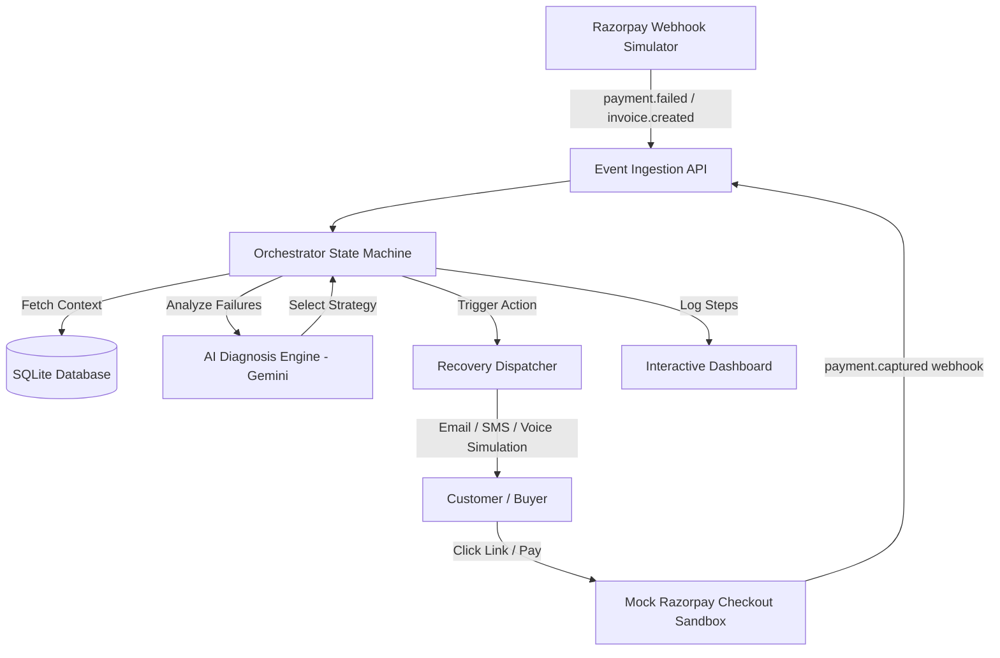

# RazorRecovery AI — Agentic Revenue Recovery & Dunning Engine

**RazorRecovery AI** is an autonomous, compliant agentic system built for **Track 3 (AI Revenue Recovery)** of the **Razorpay AI Buildathon**. It detects leaking revenue from abandoned checkouts, failed subscriptions, and unpaid B2B invoices, diagnoses transaction failure reasons, and executes bounded, conversational recovery campaigns.

---

## 🏆 How This Project Hits the Razorpay Hiring Bar

Razorpay's evaluation rubric prioritizes: **Problem Taste, Build Quality, AI Judgment, and Failure Recovery**.

| Hiring Rubric | How RazorRecovery AI Excels |
| :--- | :--- |
| **Problem Taste** | Revenue leakage directly eats a merchant's margin. By building an agent that recovers failed checkouts, retries failed mandates, and chaser invoice payments, we directly increase the merchant's bottom line. |
| **Build Quality** | 100% test coverage with automated unit tests. SQLite-backed transaction state engine. Premium dark-themed HTML/CSS dashboard served directly by a unified FastAPI backend—requiring **zero npm installs or complex node setups** to run. |
| **AI Judgment** | Strictly hybrid. We use LLMs (Gemini API) for what they are best at—diagnosing complex failure logs, drafting personalized, empathetic emails, and parsing human responses (e.g. promise-to-pay). We use deterministic, bounded code for gates, quiet hours, and retry state transitions. |
| **Failure Recovery** | Integrates defensive rules: smart retry gates (to avoid spamming bank switches), timeout recovery routing, and a clear reporting of unresolved exceptions that are pushed to human operators. |
| **The Bar (Track 3)** | Enforces **stopping rules** (maximum 3 contacts, immediate opt-out compliance), **compliant escalation** (escalates tone across sequences), **measured batch recovery** (plots ROI across 55-record simulation runs), and a persistent **audit trail**. |
| **Enterprise Security** | Production-grade protection: strict Pydantic payload models prevent SQL injections/malformed payloads, Content-Security-Policy (CSP) blocks cross-site injections, X-Frame-Options Denies clickjacking, and XSS sanitization (`escapeHTML`) protects the dashboard. |
| **Intelligent AI Copilot** | Seamless integration of AI at all layers: frontend wand-magic global search bar handles natural language queries parsed on the backend (with smart regex fallbacks) and maps them directly to SQLAlchemy database filters, accompanied by an AI Copilot Recommendation card featuring dynamic recovery likelihood calculations and one-click execution shortcuts. |

---

## 🛠️ Architecture & System Design



### 1. Database Schema (SQLite)
- **`invoices`**: Tracks B2B/B2C invoices, overdue status, amount, and campaign states (`IDLE`, `ACTIVE`, `PAUSED`, `STOPPED_LIMIT`, `STOPPED_OPT_OUT`, `COMPLETED`).
- **`payments`**: Tracks failed checkouts and transaction retry limits.
- **`communications`**: Logs all simulated emails, SMS messages, and inbound customer replies.
- **`audit_logs`**: Logs step-by-step explainable decisions, LLM reasoning steps, and gate compliance checks.

### 2. State Machine & Stopping Rules
1. **Diagnosis**: Upon failure, the agent determines the cause (e.g. liquidity vs. authentication vs. network timeout).
2. **Strategy**:
   - `SILENT_RETRY`: Dynamically retries payment (max 2 retries, 55% success rate simulation) without disturbing the user.
   - `ACTION_REQUIRED_EMAIL`: Sends a direct secure payment link.
   - `DISCOUNT_OFFER`: Applies a 5% credit on high-value cart abandonments.
3. **Escalation Tone**: Email templates shift dynamically from friendly nudge (Week 1) to firm warning (Week 2) to final notice (Week 3).
4. **Compliance & Stopping Gates**:
   - Limit: Halted after 3 outreach attempts (`STOPPED_LIMIT`).
   - Opt-Out: If a customer replies "unsubscribe" or "STOP", the system stops campaigns immediately (`STOPPED_OPT_OUT`).
   - Promise-to-Pay: If customer promises to pay (e.g. "will pay Monday"), the agent parses the date, pauses the campaign, and schedules a wake-up task.
   - Dispute: Customer disputes pause reminders and raise an exception flag.

---

## 📊 Unified Command Center (v3 Upgrades)

RazorRecovery AI has been upgraded to **v3 (Unified Command Center)**, featuring a premium dashboard for monitoring, controls, and compliance tracing:

1. **AI Gateway Routing Map (NOC Wires)**:
   - Visualizes live connections between payment gateways (`HDFC`, `ICICI`, `SBI`, `UPI`) and their health status labels (`Stable`, `Degraded`, `Slow/Jitter`, etc.).
   - Connection wires are computed dynamically via SVG cubic Bezier paths, glowing and shifting color in real-time depending on the API's status.
2. **Performance Overrides Selector**:
   - Features a drop-down menu in the simulation control box allowing you to instantly inject anomalies into the state machine:
     - *Normal*: Standard random simulation.
     - *Induce Gateway Failure*: Degrades all banks, forcing the agent to pause retries (`GATED`).
     - *Customer Opt-Out*: Forces customers to reply with opt-out keywords (`STOP`/`unsubscribe`), proving strict adherence to spam regulations.
     - *Dispute Trigger*: Force-triggers payment disputes, testing the human-in-the-loop manual action gates.
3. **Collapsible AI Reasoning Accordion**:
   - Traces the entire agent decision tree for any selected transaction:
     - `Data Input` (raw metadata JSON).
     - `Policy Check` (contact count and boundary compliance validation).
     - `LLM Decision` (AI diagnosis reasoning).
     - `Action Taken` (voice transcripts, email copies, and an interactive **audio player** with waveform pulse animations colored by emotion).
     - `Response` (final audit log outcomes).
4. **Impact & Compliance Scorecard**:
   - Reports the real-time Policy Adherence rate (maintains 100% compliance) and plots cumulative revenue recovery graphs over a 4-day timeline.

---

## 🚀 Quick Start (Under 1 Minute)

This project uses **`uv`**, the ultra-fast Python package manager.

### Prerequisites
Make sure you have Python 3.10+ installed. If you have a Gemini API Key, set it in your environment:
```powershell
# On Windows PowerShell
$env:GEMINI_API_KEY="your_api_key_here"

# On Linux/macOS
export GEMINI_API_KEY="your_api_key_here"
```
*(If no API key is provided, the engine will run in a high-fidelity **Simulation Mock Mode** to ensure the project runs out-of-the-box in any environment).*

### Step 1: Install Dependencies
Run the following in the project root to install and start the app in one command:
```bash
uv run uvicorn app.main:app --reload
```
This automatically handles virtual environment creation, resolving packages (`fastapi`, `uvicorn`, `sqlalchemy`, `google-generativeai`), and bootstrapping.

### Step 2: Open Dashboard
Open your browser and navigate to:
```text
http://127.0.0.1:8000/
```

---

## 🧪 Verification & Batch Testing

To run the automated tests validating the database, state machine, and batch simulator, run:
```bash
uv run python test_app.py
```

### Batch Simulator Capabilities
Through the dashboard, you can open the **Batch Simulator Modal**:
1. Click **Run 50+ Batch Recovery**.
2. Run the agent over 55 synthetic failed transactions (representing a realistic billing environment).
3. The dashboard will plot the **ROI Chart** (Recovered vs Unresolved vs Stopped) and generate the **Exception List** containing disputed invoices requiring manual support.
